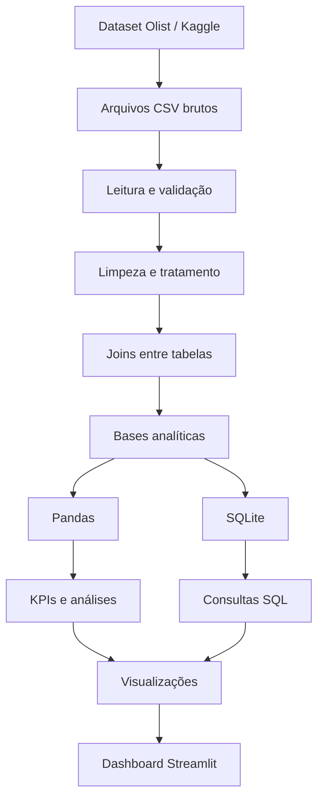

## 📚 Dataset

Este projeto utiliza o **Brazilian E-Commerce Public Dataset by Olist**, disponibilizado publicamente no Kaggle.

🔗 **Download do dataset:**  
https://www.kaggle.com/datasets/olistbr/brazilian-ecommerce

O conjunto contém dados anonimizados de aproximadamente 100 mil pedidos realizados entre 2016 e 2018 em marketplaces brasileiros.

Após o download, coloque os arquivos CSV dentro de:

```text
data/raw/
🛒 Olist E-Commerce Analytics
Projeto de análise de dados de e-commerce desenvolvido para portfólio, utilizando Python, Pandas, SQL, SQLite, Streamlit, Plotly e Matplotlib.
A proposta do projeto é transformar dados brutos de pedidos da Olist em uma análise completa de negócio, passando por leitura, tratamento, integração de tabelas, criação de indicadores, consultas SQL, visualizações e dashboard interativo.
📌 Sobre o projeto
O projeto utiliza o Brazilian E-Commerce Public Dataset by Olist, disponibilizado no Kaggle.
O conjunto de dados contém informações reais e anonimizadas de pedidos realizados por clientes da plataforma Olist, incluindo dados de:
- pedidos;
- clientes;
- produtos;
- vendedores;
- pagamentos;
- avaliações;
- fretes;
- localização;
- datas de compra e entrega.
Importante: o dataset representa as transações presentes na base da Olist e não todo o mercado brasileiro de e-commerce.

🎯 Objetivos
O projeto foi desenvolvido para responder perguntas de negócio como:
- Qual foi o faturamento gerado pelos pedidos?
- Quantos pedidos foram concluídos?
- Qual é o ticket médio?
- Como o faturamento evoluiu ao longo do tempo?
- Quais estados concentram maior faturamento?
- Quais categorias de produtos geram mais receita?
- Quais meios de pagamento são mais utilizados?
- Quanto tempo os pedidos levam para ser entregues?
- Quais estados apresentam maior tempo médio de entrega?
- Qual o percentual de pedidos atrasados?
- Atrasos influenciam a avaliação dos clientes?
- Como estão distribuídas as notas dos consumidores?
🧰 Tecnologias utilizadas
Tecnologia	Uso no projeto
Python	Desenvolvimento da análise e automação do pipeline
Pandas	Limpeza, transformação, joins e análise dos dados
SQL	Consultas analíticas
SQLite	Banco de dados local
Streamlit	Dashboard interativo
Plotly	Gráficos interativos no dashboard
Matplotlib	Geração automática de gráficos em PNG
Git / GitHub	Versionamento e publicação do projeto
VS Code	Ambiente de desenvolvimento


## 🔄 Pipeline do projeto


📊 Principais indicadores
O projeto calcula automaticamente indicadores como:
- Faturamento total
- Pedidos entregues
- Ticket médio
- Clientes únicos
- Itens vendidos
- Valor total dos produtos
- Frete total
- Frete médio por pedido
- Nota média
- Tempo médio de entrega
- Percentual de pedidos atrasados
📈 Principais análises
💰 Evolução mensal do faturamento
A análise temporal mostra a evolução do faturamento ao longo do período disponível na base.

🌎 Estados com maior faturamento
São Paulo concentra a maior parcela do faturamento da base analisada, seguido por estados como Rio de Janeiro e Minas Gerais.

📦 Categorias com maior faturamento
A análise por categoria permite identificar quais grupos de produtos tiveram maior participação na receita.
Entre os destaques aparecem categorias como:
- Health & Beauty;
- Watches & Gifts;
- Bed Bath Table;
- Sports & Leisure;
- Computers Accessories.

💳 Formas de pagamento
O cartão de crédito representa a maior parcela do valor movimentado na base analisada, seguido pelo boleto bancário.

⭐ Distribuição das avaliações
A maior parte dos pedidos recebeu avaliações altas, com predominância da nota máxima.

🚚 Impacto do atraso na avaliação
Um dos principais insights encontrados no projeto foi a relação entre atraso e satisfação do cliente.
- Pedidos entregues no prazo: nota média de aproximadamente 4,29
- Pedidos atrasados: nota média de aproximadamente 2,57

Esse resultado sugere uma forte relação entre desempenho logístico e experiência do consumidor.
🗺️ Tempo médio de entrega por estado
A análise logística também identifica diferenças importantes entre os estados brasileiros.

📋 Status dos pedidos
A maior parte dos pedidos presentes na base foi concluída e entregue.

🗄️ Banco de dados e SQL
Além das análises realizadas com Pandas, o projeto cria automaticamente um banco SQLite:
data/processed/olist_analytics.db
O banco contém tabelas analíticas para pedidos, itens e pagamentos.
Foram criadas consultas SQL para analisar:
- faturamento total;
- vendas por estado;
- categorias com maior receita;
- ticket médio;
- meios de pagamento;
- entregas atrasadas;
- relação entre atraso e avaliação.
Exemplo:
SELECT
    customer_state AS estado,
    COUNT(DISTINCT order_id) AS pedidos,
    ROUND(SUM(payment_total), 2) AS faturamento
FROM orders
WHERE order_status = 'delivered'
GROUP BY customer_state
ORDER BY faturamento DESC;
📊 Dashboard interativo
O projeto possui um dashboard desenvolvido com Streamlit + Plotly.
As páginas disponíveis são:
- 🏠 Visão Geral
- 💰 Vendas
- 📦 Produtos
- 🚚 Logística
- 💳 Pagamentos
- ⭐ Clientes
- 🔍 Insights
O dashboard também permite aplicar filtros por:
- período;
- estado.
Para executar:
streamlit run app.py
🧠 Tratamento dos dados
O processo de tratamento inclui:
- conversão de colunas de data;
- validação dos arquivos;
- tratamento de valores ausentes;
- tradução das categorias de produtos;
- agregação dos pagamentos por pedido;
- agregação dos itens por pedido;
- integração de clientes, pedidos, itens, produtos e avaliações;
- criação de métricas de entrega;
- criação de colunas de ano, mês e dia da semana.
Por que separar pedidos e itens?
Um pedido pode possuir vários produtos e também mais de um registro de pagamento.
Fazer um join direto entre essas tabelas poderia multiplicar registros e provocar duplicação de valores de faturamento.
Por isso, o projeto trabalha com bases analíticas separadas no nível de:
- pedido;
- item vendido.
Essa abordagem evita distorções nos indicadores.
💡 Principais insights
A análise realizada permite observar alguns padrões relevantes dentro do dataset:
- São Paulo apresenta a maior concentração de faturamento.
- Rio de Janeiro e Minas Gerais também possuem participação relevante.
- Saúde e beleza aparece entre as categorias de maior receita.
- Cartão de crédito é o principal meio de pagamento.
- Existem diferenças significativas de tempo de entrega entre estados.
- A maior parte dos pedidos recebeu avaliações positivas.
- Atrasos possuem forte associação com avaliações mais baixas.
- O desempenho logístico possui impacto importante na experiência do cliente.
▶️ Como executar
1. Clone o repositório
git clone https://github.com/RoninXK/olist-ecommerce-analytics.git
Entre na pasta:
cd olist-ecommerce-analytics
2. Crie o ambiente virtual
Windows
python -m venv .venv
.venv\Scripts\activate
3. Instale as dependências
pip install -r requirements.txt
4. Adicione o dataset
Os arquivos brutos não são armazenados no GitHub devido ao tamanho.
Baixe o Brazilian E-Commerce Public Dataset by Olist no Kaggle e coloque os arquivos CSV diretamente em:
data/raw/
Arquivos esperados:
olist_customers_dataset.csv
olist_geolocation_dataset.csv
olist_order_items_dataset.csv
olist_order_payments_dataset.csv
olist_order_reviews_dataset.csv
olist_orders_dataset.csv
olist_products_dataset.csv
olist_sellers_dataset.csv
product_category_name_translation.csv
5. Execute o tratamento
python src/tratamento.py
6. Gere os indicadores
python src/estatisticas.py
7. Crie o banco SQLite
python src/banco.py
8. Execute as consultas SQL
python src/executar_sql.py
9. Gere os gráficos
python src/graficos.py
10. Execute o dashboard
streamlit run app.py
📚 Dataset
Brazilian E-Commerce Public Dataset by Olist
Base pública disponibilizada no Kaggle para estudos e projetos de análise de dados.
Os registros utilizados neste projeto são anonimizados.
⚠️ Observações
Este projeto foi desenvolvido para fins de estudo e portfólio.
As análises representam somente os dados presentes no dataset utilizado e não devem ser interpretadas como uma representação completa de todo o mercado brasileiro de e-commerce.
👨‍💻 Autor
Flávio Ferreira Alves
Estudante de Engenharia de Software com interesse em:
- Data Analytics
- Python
- SQL
- Automação
- Desenvolvimento de Software
GitHub: @RoninXK
